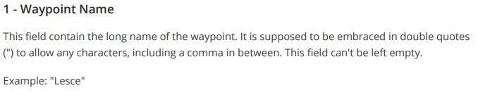
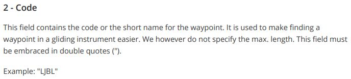
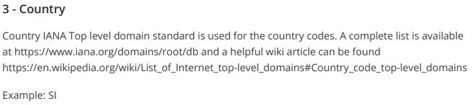
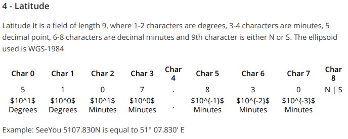
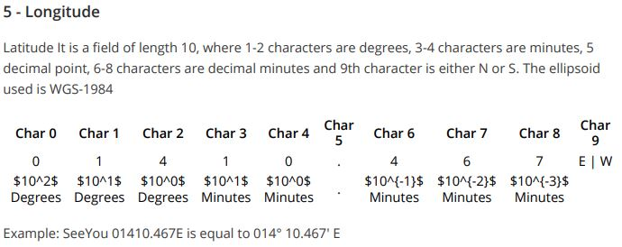
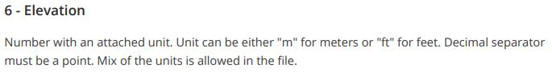
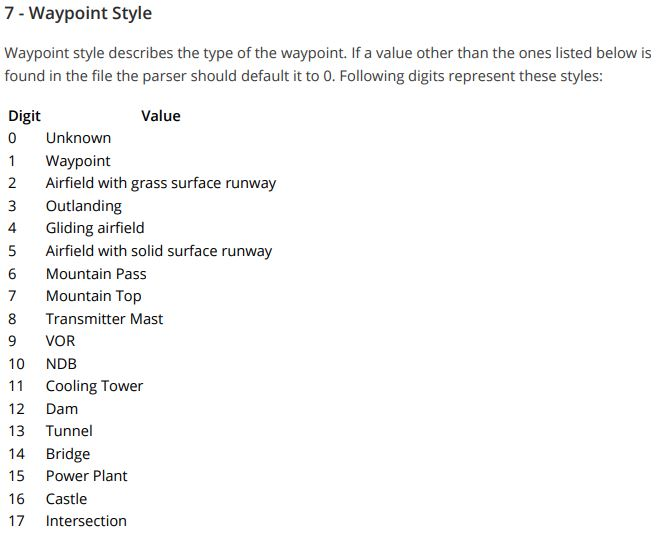
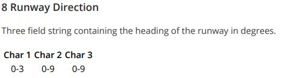
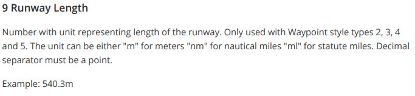
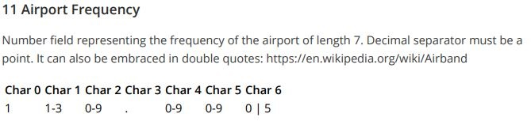

# AZTurnpoints
This is a list of turnpoints for Arizona, focused around Estrella and El Tiro, but extending into California, Nevada, Utah, and New Mexico.  
For a detailed step by step walkthrough, see  
https://docs.google.com/presentation/d/1pMjyXVpgSP-2waq6FuD5_nyMrU_6ApVSMYG6YpMSBvM/edit?usp=sharing  

In this file some waypoints have **suffixes**:  
* x: no longer landable, do not land here
* u: an in-person survey has not been done, satellite survey only
* 911: emergency only, may be to narrow or unsuitable
* 911 u: emergency only and unsurveyed
  
This cup file will attempt to stay consistent with the Tucson Soaring XC Map at https://www.google.com/maps/d/u/0/edit?mid=1kHawbgbNa_hPMl5rvOVMP27UdMX1PvQ_&ll=32.39213804431958%2C-111.49211784793266&z=11

## How do I download AZTurnpoints.cup?
Peroidic releases will occur, downloadable on the right side of the page under "Releases"

## How do I contribute to AZTurnpoints.cup?
1) Click on AZTurnpoints2021.cup
2) Click on the pencil icon in the top right corner
3) Modify the file as necessary, try to keep changes to a single function or turnpoint so that a history is easily viewable
4) At the bottom of the page, write a quick summary of changes ie. "deleted duplicate flying dare's ranch" and hit propose changes
5) Click create pull request (twice)
6) Someone with write access to the main branch can approve and merge changes into the main branch

## How do I see what has changed?
Releases will contain release notes summarizing changes since the previous release.  
  
To see individual changes:  
1) Click on AZTurnpoints2021.cup
2) Click History at the top right
3) Click any commit to see what was updated

## What is a .cup file?
.cup is a comma separated value (csv) file with the following 14 fields:

name,code,country,lat,lon,elev,style,rwdir,rwlen,rwwidth,freq,desc,userdata,pics  
*Fields 13 userdata and 14 pics are not used by XCSoar*

  

  

  

  

   

  

  

  

  
  
### 10 Runway Width
Number with unit representing width of the runway. Only used with Waypoint style types 2, 3, 4, and 5. The unit can be either "m" for meters "nm" for nautical miles "mi" for statute miles. Decimal separator must be a point.
  
Example: 15.3m
  
  

### 12 Description and Best Practices
Keep the description to 200 characters or less to ensure the full message is displayed on all devices. If a comma is used in the description field, enclose the field in quotes.   
Key things to add to the description field (examples below): Month/Year of update, CTAF, AWOS, Rwy direction, Rwy length, Rwy width, retrieve specific notes, landing specific notes  

Apr2021 Buckeye BXK122.8 AWOS:119.625 RY 17/35:5500x75MGR: KIMM FLATT|623-349-6651  
May2021 Mobile 1AZ0 130.475 RY 09/27:4500x75MGR: Josh Seagrave 5207238820 Parachute operations

Keep commits small, one or two waypoints so there is a clear history of what has changed. Please do not update 50 waypoints in one go.  
If an airport is discovered to be unlandable, rename it with a lower case “x” in front, ie. “x Empire Ranch” and change it to Waypoint Type 1 to ensure it is not displayed as an airport, Do not delete the waypoint

### 13 Userdata
Not used for now

### 14 Pics
Not used for now

## Tools
* Cup file helper tool to easily decode and encode rows and convert lat lon https://docs.google.com/spreadsheets/d/1wbVaSxi1VFkD8yJkzLH4jYHOpkiJ1mFUrmz59kaaugs/edit?usp=sharing  
* Google maps coordinates to DDMM.MMM converter https://www.sunearthtools.com/dp/tools/conversion.php  
* Find elevation https://www.freemaptools.com/elevation-finder.htm
